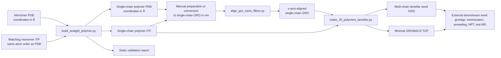
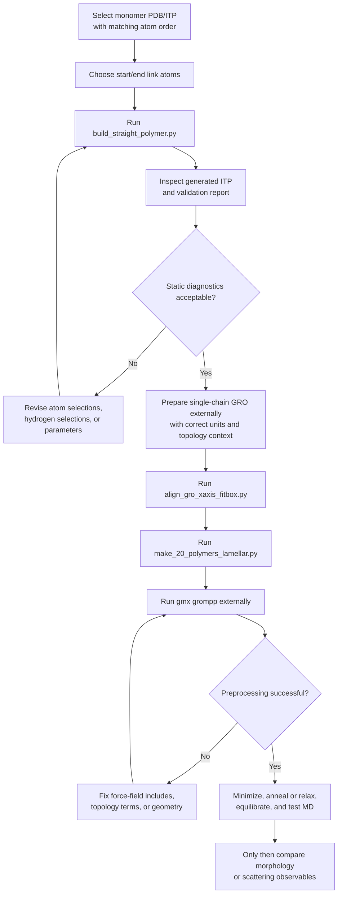

# Straight-Chain Polymer Construction and Lamellar Seed Generation


A command-line toolkit for preparing polymer molecular-dynamics starting structures from monomer-level coordinate and topology files.

The repository contains three standalone Python scripts that can be used as a **manual, modular workflow**:

1. build an `N`-repeat straight polymer from a monomer PDB and matching GROMACS-style ITP,
2. align a single-chain GRO structure along the x-axis and fit it into a padded box,
3. generate an ordered multi-chain lamellar seed for downstream GROMACS relaxation.

The generated structures should be interpreted as **initial models**. They are not force-field parameterizations, equilibrated morphologies, X-ray-refined structures, or validated production-ready systems.

---

## Why this repository exists

Polymer MD setup often requires several fragile preparation steps: creating a connected repeat-unit chain, maintaining compatible topology sections, orienting the chain reproducibly, and placing multiple chains into a simulation seed structure.

This repository provides small, inspectable scripts for those preparation tasks. The design goal is reproducibility and transparent file generation rather than full automation.

The scripts are especially suitable for a publication companion repository where every structure-generation step should be explicit, repeatable, and distinguishable from later MD validation.

---

## Graphical abstract



---

## Repository scope

### Implemented

- Construction of a straight repeat-unit polymer coordinate model from a monomer PDB.
- Generation of a corresponding polymer ITP from selected monomer topology sections.
- User-defined inter-repeat link atoms.
- Automatic or explicit removal of hydrogens at polymerization sites.
- Redistribution of removed hydrogen charge onto the corresponding parent atom.
- Replication of supported bonded topology sections.
- Addition of generic cross-repeat bonds, angles, 1-4 pairs, and proper dihedrals.
- Static topology and coordinate diagnostics.
- PCA/SVD alignment of a GRO structure's selected long axis to x.
- Padded orthorhombic GRO box generation.
- Deterministic multi-chain lamellar seed placement with optional random jitter.
- Minimal GROMACS TOP generation for the multi-chain seed.

### Not implemented

- Fully automated end-to-end orchestration.
- PDB-to-GRO conversion.
- Unit conversion between PDB Å coordinates and GRO nm coordinates.
- Force-field derivation or parameter optimization.
- Preservation of arbitrary ITP sections.
- GROMACS execution.
- Energy minimization, annealing, equilibration, or production MD.
- GIWAXS simulation, fitting, or validation.
- X-ray-refined morphology generation.

---

## Component summary

| Script | Purpose | Primary inputs | Primary outputs |
|---|---|---|---|
| `build_straight_polymer.py` | Build a connected straight `N`-repeat polymer from a monomer PDB/ITP pair. | Monomer `.pdb`, monomer `.itp`, repeat count, start/end link atoms. | Polymer `.pdb`, polymer `.itp`, validation `.txt`. |
| `align_gro_xaxis_fitbox.py` | Rotate a GRO molecule so its long/core axis lies along x and place it in a padded box. | Single-chain `.gro`. | Aligned and boxed `.gro`. |
| `make_20_polymers_lamellar.py` | Replicate one aligned chain into a loose lamellar multi-chain seed. | Single-chain `.gro`, single-chain `.itp`. | Multi-chain `.gro`, minimal `.top`. |

The tools can be chained by manually passing files between steps. They do not import or call one another.

---

## Important unit conventions

| File type or option | Unit convention in the provided scripts |
|---|---|
| PDB coordinates read/written by `build_straight_polymer.py` | Å |
| `--link-length` in `build_straight_polymer.py` | Å |
| GRO coordinates read/written by `align_gro_xaxis_fitbox.py` | nm |
| GRO coordinates read/written by `make_20_polymers_lamellar.py` | nm |
| `--padding`, `--lamellar-d-nm`, `--gap-y-nm`, `--margin-nm`, `--jitter-nm` | nm |
| Default inter-repeat ITP bond length field `0.1530` | nm, consistent with GROMACS topology convention |

The repository does not perform PDB-to-GRO conversion or Å-to-nm coordinate conversion. That handoff must be handled externally and documented in any reproducible workflow.

---

## Script 1: Build a straight polymer

### Purpose

`build_straight_polymer.py` builds an `N`-repeat straight-core polymer from a monomer PDB and matching GROMACS/ATB/GROMOS-style ITP.

For repeat `i -> i+1`, the generated inter-repeat bond is:

```text
end(i) -- start(i+1)
```

where:

- `--start` is the atom in each repeat that bonds to the previous repeat,
- `--end` is the atom in each repeat that bonds to the next repeat.

### Required inputs

```bash
python build_straight_polymer.py \
  --pdb monomer.pdb \
  --itp monomer.itp \
  --n 10 \
  --start C25 \
  --end C21 \
  --out-prefix polymer_10mer
```

### Input assumptions

The script assumes:

- the PDB atom order matches the ITP `[ atoms ]` order,
- the PDB and ITP have the same number of atoms,
- link atoms are specified either by unique atom name or 1-based atom index,
- the ITP contains:
  - `[ moleculetype ]`
  - `[ atoms ]`
  - `[ bonds ]`
  - `[ pairs ]`
  - `[ angles ]`
  - at least two `[ dihedrals ]` sections,
- the first `[ dihedrals ]` section is treated as improper dihedrals,
- the second `[ dihedrals ]` section is treated as proper dihedrals,
- optional `[ exclusions ]` entries may be present.

This is a limited ITP parser. It does not preserve arbitrary sections such as atomtype includes, constraints, settles, virtual sites, position restraints, conditional preprocessor blocks, or additional dihedral sections.

### Hydrogen removal

During polymer construction, one hydrogen is removed from each internal link site:

- the `--end-h` atom is removed from every repeat except the last,
- the `--start-h` atom is removed from every repeat except the first.

Hydrogens can be supplied explicitly:

```bash
python build_straight_polymer.py \
  --pdb monomer.pdb \
  --itp monomer.itp \
  --n 12 \
  --start C25 \
  --end C21 \
  --start-h H25A \
  --end-h H21A \
  --out-prefix polymer_12mer
```

If hydrogens are not supplied, the script selects bonded hydrogens using the repeat-axis direction:

- the start-side hydrogen is selected opposite the start-to-end axis,
- the end-side hydrogen is selected along the start-to-end axis.

For chemically sensitive systems, explicit `--start-h` and `--end-h` selections are recommended.

### Coordinate construction

The repeat axis is defined from the monomer `--start` coordinate to the monomer `--end` coordinate. Each repeat is translated by:

```text
(end - start) + axis * link_length
```

With the default `--link-length 1.54`, the generated PDB geometry places adjacent link atoms approximately 1.54 Å apart along the repeat axis.

### Topology construction

The output ITP is newly written by the script. It does not copy the original ITP preamble or include statements.

Implemented topology behavior:

- supported monomer sections are replicated for each repeat,
- entries involving removed hydrogens are skipped,
- inter-repeat bonds are added,
- missing cross-repeat angles are generated from the bond graph,
- missing cross-repeat 1-4 pairs are generated from cross-repeat four-atom paths,
- missing cross-repeat proper dihedrals are generated from cross-repeat four-atom paths,
- optional exclusions are replicated when present,
- charge from each removed hydrogen is added to the parent link atom,
- output charge-group numbers are written as the new atom index.

Default generated cross-repeat parameters are generic and can be overridden:

```bash
python build_straight_polymer.py \
  --pdb monomer.pdb \
  --itp monomer.itp \
  --n 10 \
  --start C25 \
  --end C21 \
  --out-prefix polymer_10mer \
  --link-bond "2 0.1530 7.1500e+06" \
  --pair "1" \
  --angle-hcc "2 111.00 530.00" \
  --angle-heavy "2 109.50 520.00" \
  --dihedral "1 0.00 5.92 3"
```

These defaults should be treated as provisional starting parameters, not validated force-field terms.

### Outputs

For `--out-prefix polymer_10mer`, the script writes:

```text
polymer_10mer.pdb
polymer_10mer.itp
polymer_10mer_validation.txt
```

| Output | Description |
|---|---|
| `polymer_10mer.pdb` | Generated straight-chain polymer coordinates with PDB `CONECT` records. |
| `polymer_10mer.itp` | Generated molecule topology containing supported bonded sections. |
| `polymer_10mer_validation.txt` | Static diagnostic report. |

### Static validation report

The report includes:

- atom count,
- total charge,
- selected start/end atoms,
- selected or inferred hydrogens removed,
- number of generated cross-repeat angles,
- number of generated cross-repeat pairs,
- number of generated cross-repeat proper dihedrals,
- bad reference counts for selected topology sections,
- duplicate-key counts for selected topology sections,
- missing cross-repeat term counts after generation,
- simple severe-clash count for systems up to 8000 atoms.


---

## Script 2: Align a GRO structure along x

### Purpose

`align_gro_xaxis_fitbox.py` rotates and translates a GROMACS `.gro` molecule so that its selected long molecular/core axis lies along the x-axis. It then places the molecule in an orthorhombic box with a specified padding from all box edges.

### Basic use

```bash
python align_gro_xaxis_fitbox.py polymer_10mer.gro \
  -o polymer_10mer_xaxis.gro
```

### Custom padding

```bash
python align_gro_xaxis_fitbox.py polymer_10mer.gro \
  -o polymer_10mer_xaxis_pad0p3.gro \
  --padding 0.3
```

`--padding` is in nm and must be greater than zero.

### Atom selection for axis fitting

By default, the script excludes hydrogen-like atom names and uses heavy atoms for the PCA/SVD fit.

```bash
python align_gro_xaxis_fitbox.py polymer_10mer.gro \
  -o polymer_10mer_xaxis.gro \
  --selection heavy
```

To use all atoms:

```bash
python align_gro_xaxis_fitbox.py polymer_10mer.gro \
  -o polymer_10mer_xaxis_allatoms.gro \
  --selection all
```

To define a chemically specific core:

```bash
python align_gro_xaxis_fitbox.py polymer_10mer.gro \
  -o polymer_10mer_core_xaxis.gro \
  --core-names C1,C2,C3,C4,C5,C6,N1,N2
```

When `--core-names` is supplied, it overrides `--selection` and requires at least three matching atoms.

### Orientation sign convention

After PCA/SVD, the first principal component is mapped to x. By default, the x-axis sign is made deterministic by orienting later atom numbers toward `+x`.

To disable this behavior:

```bash
python align_gro_xaxis_fitbox.py polymer_10mer.gro \
  -o polymer_10mer_xaxis_no_index_orient.gro \
  --no-index-orient
```

### Output behavior

The script:

- preserves fixed-width residue and atom columns,
- preserves suffix text after the coordinate fields, including velocity columns when present,
- writes a three-vector orthorhombic box,
- writes coordinates with standard GRO `8.3f` precision,
- prints PCA variance percentages,
- prints the original-basis direction of the new x-axis,
- prints final box lengths and rounded coordinate ranges.

If `--output` is omitted, the default output filename is:

```text
<input_stem>_xaxis_centered_<padding>nm.gro
```

The word `centered` in the default filename is historical: the implemented operation places the molecule so that the minimum coordinate in each dimension equals the requested padding.

---

## Script 3: Generate a lamellar multi-chain seed

### Purpose

`make_20_polymers_lamellar.py` creates a loose ordered multi-chain seed from a single-chain GRO and ITP. Despite the filename and default output names, the number of chains is controlled by `--nmol`.

The default setup creates 20 chains arranged as 5 chains per y-layer and stacked in z.

### Basic use

```bash
python make_20_polymers_lamellar.py \
  --gro polymer_10mer_xaxis.gro \
  --itp polymer_10mer.itp \
  --nmol 20 \
  --ny 5 \
  --out-gro polymer_10mer_20chain_lamellar_seed.gro \
  --out-top topol_20_polymer_10mer.top
```

### Optional force-field include

If atom types are defined outside the molecule ITP, provide an include file:

```bash
python make_20_polymers_lamellar.py \
  --gro polymer_10mer_xaxis.gro \
  --itp polymer_10mer.itp \
  --ff-include forcefield.itp \
  --out-gro polymer_10mer_20chain_lamellar_seed.gro \
  --out-top topol_20_polymer_10mer.top
```

The generated `.top` places this include above the molecule ITP include.

### Placement logic

The script reads the single-chain coordinate extents and computes:

```text
nz = ceil(nmol / ny)
y_step = y_extent + gap_y_nm
z_step = max(lamellar_d_nm, z_extent + 0.25)
```

Each chain is centered into the generated grid, with:

- a common aligned orientation,
- small alternating x-offsets of 0.15 nm for some chains/layers,
- optional seeded random jitter in x, y, and z,
- residue ID offsets between replicated chains.

### Main placement options

| Option | Default | Meaning |
|---|---:|---|
| `--gro` | `1(6).gro` | Input single-chain GRO. |
| `--itp` | `1(4).itp` | Input single-chain ITP. |
| `--nmol` | `20` | Number of chains to place. |
| `--ny` | `5` | Chains per layer along y. |
| `--lamellar-d-nm` | `2.80` | Requested layer spacing along z, unless the chain z-extent requires a larger spacing. |
| `--gap-y-nm` | `0.45` | Extra y clearance beyond the chain y-extent. |
| `--margin-nm` | `0.55` | Box margin. |
| `--jitter-nm` | `0.03` | Maximum absolute random displacement per coordinate. |
| `--seed` | `20260618` | Random seed for deterministic jitter. |
| `--out-gro` | `20_JR4Q_lamellar_seed.gro` | Output seed structure. |
| `--out-top` | `topol_20_JR4Q.top` | Output topology. |
| `--ff-include` | `None` | Optional force-field or atomtypes include. |

### Outputs

| Output | Description |
|---|---|
| Multi-chain `.gro` | Replicated lamellar seed coordinates. |
| Minimal `.top` | Includes optional force-field include, molecule ITP, `[ system ]`, and `[ molecules ]`. |

### Current implementation caveats

- Velocity columns from the input GRO are not preserved by this script.
- GRO atom and residue IDs are written modulo 100000 because of fixed-width GRO fields.
- There is no explicit guard against systems exceeding 99999 atoms.
- The first comment line in the generated TOP says "20-polymer seed" even when `--nmol` is changed; the actual `[ molecules ]` count is written from `--nmol`.

The output should be treated as a morphology seed for relaxation, not as an equilibrated or experimentally validated structure.

---

## Combined workflow concept

The scripts can be used together as follows:



---

## Quick start

The following commands assume the scripts are in the repository root. If they are moved into a `scripts/` directory, adjust paths accordingly.

### 1. Build a 10-repeat polymer

```bash
python build_straight_polymer.py \
  --pdb monomer.pdb \
  --itp monomer.itp \
  --n 10 \
  --start C25 \
  --end C21 \
  --out-prefix polymer_10mer
```

Expected files:

```text
polymer_10mer.pdb
polymer_10mer.itp
polymer_10mer_validation.txt
```

### 2. Prepare a single-chain GRO

This repository does not automate PDB-to-GRO conversion. Use a topology-aware external workflow and ensure the resulting GRO coordinates are in nm.

Example target file for the next step:

```text
polymer_10mer.gro
```

### 3. Align the single-chain GRO

```bash
python align_gro_xaxis_fitbox.py polymer_10mer.gro \
  -o polymer_10mer_xaxis.gro \
  --padding 0.2
```

### 4. Generate a 20-chain lamellar seed

```bash
python make_20_polymers_lamellar.py \
  --gro polymer_10mer_xaxis.gro \
  --itp polymer_10mer.itp \
  --nmol 20 \
  --ny 5 \
  --out-gro polymer_10mer_20chain_lamellar_seed.gro \
  --out-top topol_20_polymer_10mer.top
```

### 5. Validate with GROMACS externally

A typical next step is GROMACS preprocessing and minimization using study-specific `.mdp` files and force-field includes:

```bash
gmx grompp \
  -f minim.mdp \
  -c polymer_10mer_20chain_lamellar_seed.gro \
  -p topol_20_polymer_10mer.top \
  -o em.tpr

gmx mdrun -deffnm em
```

These commands are not run by the Python scripts.

---

## Outputs produced by each workflow

| Workflow step | Files written | Notes |
|---|---|---|
| Polymer build | `<out-prefix>.pdb`, `<out-prefix>.itp`, `<out-prefix>_validation.txt` | PDB coordinates in Å. Generated ITP is limited to supported sections. |
| GRO alignment | user-selected `.gro`, or default `<input_stem>_xaxis_centered_<padding>nm.gro` | Coordinates in nm. Orthorhombic box. |
| Lamellar seed | `--out-gro`, `--out-top` | Coordinates in nm. Minimal TOP may require additional includes. |

---

## Confidence and decision logic

### Highest-confidence behavior

The following behavior is directly implemented and deterministic for fixed inputs:

- atom-count checking between PDB and ITP in the polymer builder,
- required-section checks in the polymer builder,
- user-defined start/end atom resolution by name or 1-based index,
- coordinate translation for repeat placement,
- PCA/SVD alignment for selected GRO atoms,
- fixed-seed random jitter in lamellar seed generation.

### Heuristic behavior

The following behavior is implemented but should be inspected chemically:

- automatic hydrogen selection at polymerization sites,
- first-letter element matching between PDB and ITP atom names,
- generic cross-repeat parameter assignment,
- heavy-atom detection in GRO files using hydrogen-like atom-name patterns,
- PCA-based inference of molecular/core long axis,
- lamellar spacing as an initial packing choice.

### External validation required

The following cannot be established by these scripts alone:

- correctness of force-field parameters,
- absence of topology problems under GROMACS preprocessing,
- physically reasonable density or morphology,
- stability under MD,
- agreement with scattering or experimental observables.

---


---

## Suggested software environment

### Python

Python 3.10 or newer is recommended.

### Python dependencies

Only one non-standard Python package is required by the provided scripts:

```bash
pip install numpy
```

| Script | Standard-library only? | External Python dependency |
|---|---:|---|
| `build_straight_polymer.py` | Yes | None |
| `align_gro_xaxis_fitbox.py` | No | `numpy` |
| `make_20_polymers_lamellar.py` | Yes | None |

### External tools

GROMACS is recommended for downstream validation and simulation, but it is not imported, called, or controlled by the scripts.

---

-

## Limitations

- The scripts are standalone utilities, not a workflow manager.
- The polymer builder assumes identical PDB and ITP atom ordering.
- The polymer builder requires a relatively specific ITP section organization (from https://atb.uq.edu.au/)
- The aligner uses geometric PCA/SVD, not a chemically constrained fit.
- The lamellar generator creates an ordered seed, not an equilibrated morphology.
- Large GRO outputs may suffer from fixed-width atom/residue ID rollover.

---


## Acknowledgments

This toolkit writes files intended for downstream use in GROMACS-oriented molecular simulation workflows. 
