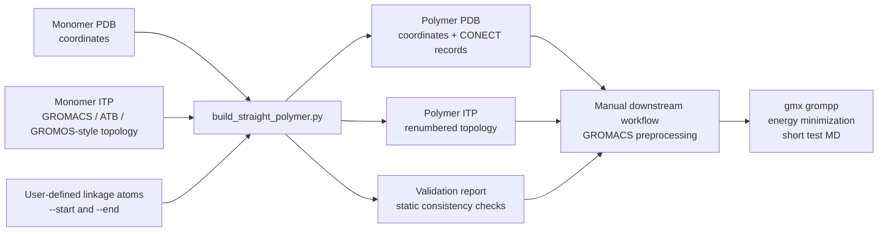

# Straight-Core Polymer Builder

[](https://www.python.org/)
[](https://manual.gromacs.org/)
[](#quick-start)
[](#validation-and-decision-logic)
[](#license)

A standalone Python command-line utility for constructing an **N-repeat straight-core polymer model** from a monomer **PDB coordinate file** and a matching **GROMACS / ATB / GROMOS-style `.itp` topology**.

The script generates a polymer `.pdb`, a corresponding polymer `.itp`, and a static validation report. It is intended as a practical topology-building aid for preparing initial polymer structures, not as a replacement for force-field validation, `gmx grompp`, minimization, or test molecular dynamics.

---

## Why this repository exists

Preparing oligomeric or polymeric starting structures for molecular simulation often requires repetitive but error-prone bookkeeping:

- duplicating monomer coordinates,
- removing terminal hydrogens used for inter-repeat linkage,
- renumbering atoms,
- replicating bonded topology terms,
- adding inter-repeat bonds,
- generating cross-repeat angles, 1-4 pairs, and proper dihedrals,
- checking that output atom references remain internally consistent.

This repository provides a focused script, `build_straight_polymer.py`, that automates those bookkeeping steps for a specific and transparent use case: **linear construction of a straight-core polymer from a monomer PDB/ITP pair with matching atom order**.

The generated topology is suitable as a starting point for further molecular simulation preparation, but the inter-repeat bonded parameters are generic defaults and must be reviewed for the target chemistry.

---

## Graphical abstract



> The diagram describes the intended manual workflow. The repository does not currently implement full GROMACS orchestration.

---

## Repository scope

### Implemented

This repository currently implements one standalone command-line script:

| Component | Status | Purpose |
|---|---:|---|
| `build_straight_polymer.py` | Implemented | Builds an N-repeat straight polymer PDB and matching ITP from a monomer PDB/ITP pair. |

### Not implemented

The current code does **not** perform:

- automated force-field parameter derivation,
- quantum chemistry,
- GROMACS execution,
- energy minimization,
- production molecular dynamics,
- rigorous physical validation,
- multi-chain packing,
- conformational sampling,
- topology inclusion-file assembly beyond the generated molecule `.itp`.

---

## Component overview

### `build_straight_polymer.py`

`build_straight_polymer.py` constructs a polymer by translating copies of the monomer along the vector from a user-specified `--start` atom to a user-specified `--end` atom.

For adjacent repeats, the script creates an inter-repeat bond:

```text
end(i) -- start(i+1)
```

The terms `--start` and `--end` have specific meanings:

- `--start`: atom in each repeat that bonds to the **previous** repeat.
- `--end`: atom in each repeat that bonds to the **next** repeat.

For each internal linkage, the script removes one hydrogen from the linking atoms, redistributes the removed hydrogen charge onto the parent atom, and writes a new polymer topology.

---

## Combined workflow concept

The intended workflow is:

1. Prepare a monomer PDB file.
2. Prepare a matching monomer `.itp` file.
3. Ensure the PDB atom order matches the `[ atoms ]` order in the `.itp`.
4. Run `build_straight_polymer.py`.
5. Inspect the generated `.pdb`, `.itp`, and validation report.
6. Manually integrate the generated `.itp` into a GROMACS system topology.
7. Run `gmx grompp`, energy minimization, and short test MD.
8. Revise linkage parameters if needed.

The script automates polymer construction and internal bookkeeping, but downstream simulation setup remains manual.

---

## Highlights

- Builds an N-repeat polymer from a monomer PDB/ITP pair.
- Requires atom-count consistency between PDB and ITP inputs.
- Checks apparent element consistency between PDB atom records and ITP atom names.
- Supports linkage atoms specified by atom name or 1-based atom index.
- Automatically selects removable hydrogens by geometric direction unless explicitly provided.
- Removes terminal hydrogens involved in polymerization.
- Redistributes removed hydrogen charges onto the corresponding parent atoms.
- Replicates monomer bonds, pairs, angles, improper dihedrals, proper dihedrals, and optional exclusions.
- Adds inter-repeat bonds using user-overridable default parameters.
- Generates missing cross-repeat angles, 1-4 pairs, and proper dihedrals.
- Writes a static validation report for bookkeeping checks.

---

## Code-to-README validation note

This README describes behavior implemented in `build_straight_polymer.py`. Claims are limited to the script’s visible functionality: parsing PDB/ITP inputs, constructing a straight translated polymer, writing PDB/ITP outputs, and performing static consistency checks. The script’s validation report is a structural and bookkeeping screen, not a physical or force-field validation.

---

## Detailed workflow

### 1. Input parsing

The script reads:

- `ATOM` and `HETATM` records from a monomer PDB file,
- optional `CONECT` records from the PDB,
- topology sections from a GROMACS-style `.itp` file.

The `.itp` parser expects the following sections:

```text
[ moleculetype ]
[ atoms ]
[ bonds ]
[ pairs ]
[ angles ]
[ dihedrals ]
[ dihedrals ]
```

The script expects two `[ dihedrals ]` sections:

1. first interpreted as improper dihedrals,
2. second interpreted as proper dihedrals.

The `[ exclusions ]` section is optional and is replicated when present.

---

### 2. Input consistency checks

Before polymer construction, the script checks that:

- the number of PDB atoms equals the number of ITP atoms,
- the apparent element identity from the PDB is consistent with the element inferred from the ITP atom name,
- the requested repeat count `--n` is at least 1,
- `--start` and `--end` resolve to valid atoms,
- selected removable hydrogens are bonded to their specified parent atoms.

By default, the script aborts on apparent element mismatches. This behavior can be bypassed with:

```bash
--allow-element-mismatch
```

Use this option cautiously. It disables an important atom-order safety check.

---

### 3. Polymer coordinate construction

The straight polymer axis is defined from the monomer `--start` atom to the monomer `--end` atom.

The repeat-to-repeat translation is computed as:

```text
translation = vector(start -> end) + link_length * unit_vector(start -> end)
```

The default inter-repeat coordinate spacing uses:

```bash
--link-length 1.54
```

with units of Ångström for PDB coordinates.

This produces a straight translated polymer geometry. The script does not perform conformational relaxation or energy minimization.

---

### 4. Hydrogen removal

For polymerization, the script removes:

- the selected `--end-h` hydrogen from all repeats except the final repeat,
- the selected `--start-h` hydrogen from all repeats except the first repeat.

If `--start-h` or `--end-h` is not provided, the script attempts to choose an attached hydrogen geometrically:

- `--start-h`: hydrogen pointing opposite the polymer axis,
- `--end-h`: hydrogen pointing along the polymer axis.

Explicit hydrogen selection is recommended when atom naming or geometry makes automatic selection ambiguous.

---

### 5. Charge handling

When a hydrogen is removed, its charge is added to the corresponding parent atom:

- removed `end-h` charge is added to the `--end` atom,
- removed `start-h` charge is added to the `--start` atom.

The script reports the final total charge in the generated `.itp` and validation report.

This is a bookkeeping strategy for preserving charge after hydrogen removal. It does not constitute force-field reparameterization.

---

### 6. Topology replication

The script replicates monomer topology terms for each repeat, omitting terms that refer to atoms removed during linkage construction.

Replicated sections include:

- `[ bonds ]`
- `[ pairs ]`
- `[ angles ]`
- first `[ dihedrals ]` section, treated as improper dihedrals
- second `[ dihedrals ]` section, treated as proper dihedrals
- `[ exclusions ]`, if present

All atom indices are renumbered for the polymer.

---

### 7. Inter-repeat topology generation

The script adds inter-repeat bonds between adjacent repeats:

```text
end(i) -- start(i+1)
```

It then constructs the polymer bond graph and adds missing cross-repeat terms:

- cross-repeat angles,
- cross-repeat 1-4 pairs,
- cross-repeat proper dihedrals.

The default added terms are generic and user-overridable:

| CLI option | Default | Meaning |
|---|---:|---|
| `--link-bond` | `2 0.1530 7.1500e+06` | Fields appended after `ai aj` for inter-repeat bonds. |
| `--pair` | `1` | Fields appended after `ai aj` for generated 1-4 pairs. |
| `--angle-hcc` | `2 111.00 530.00` | Parameters for H-C-C-like cross angles. |
| `--angle-heavy` | `2 109.50 520.00` | Parameters for heavy-C-C-like cross angles. |
| `--dihedral` | `1 0.00 5.92 3` | Parameters for generated cross-repeat proper dihedrals. |

These defaults are described in the script as generic GROMOS/ATB-like terms. They should be replaced or validated for the specific chemical system.

---

## Outputs

For an output prefix such as:

```bash
--out-prefix polymer_10mer
```

the script writes:

| Output | Description |
|---|---|
| `polymer_10mer.pdb` | Polymer coordinate file with `HETATM` records and `CONECT` records. |
| `polymer_10mer.itp` | Polymer molecule topology with replicated and generated bonded terms. |
| `polymer_10mer_validation.txt` | Static validation report. |

The script also prints a short run summary to standard output, including atom count, total charge, added cross terms, and validation counters.

---

## Validation and decision logic

The validation report includes static checks for:

- total atom count,
- total charge,
- bad atom references in topology sections,
- duplicate bonds, pairs, angles, and proper dihedrals,
- mismatch between internal bond graph and output PDB `CONECT` records,
- missing cross-repeat angles,
- missing cross-repeat 1-4 pairs,
- missing cross-repeat proper dihedrals,
- severe short-distance clashes, excluding bonded and 1-3 pairs.

The severe clash screen is a simple distance-based check. It is useful for identifying obvious coordinate problems, but it is not a substitute for molecular mechanics validation.

The report explicitly notes that users should run:

```text
gmx grompp
energy minimization
short test MD
```

before production simulations.

---

## Suggested repository layout

```text
.
├── README.md
├── build_straight_polymer.py
├── examples/
│   ├── monomer.pdb
│   ├── monomer.itp
│   └── run_build.sh
├── outputs/
│   └── .gitkeep
├── tests/
│   └── test_build_straight_polymer.py
├── environment.yml
├── pyproject.toml
└── LICENSE
```

Only `build_straight_polymer.py` is required by the current implementation. The remaining files are recommended additions for publication readiness.

---

## Suggested software environment

The script uses only the Python standard library.

Required Python modules are standard-library modules:

- `argparse`
- `math`
- `os`
- `re`
- `collections`
- `dataclasses`
- `typing`

A minimal environment is therefore:

```bash
python --version
```

A modern Python 3 environment is recommended. No third-party Python packages are required by the script itself.

External software such as GROMACS is not called by the script, but is expected for downstream validation and simulation.

---

## Quick start

```bash
python build_straight_polymer.py \
    --pdb monomer.pdb \
    --itp monomer.itp \
    --n 10 \
    --start C25 \
    --end C21 \
    --out-prefix polymer_10mer
```

This writes:

```text
polymer_10mer.pdb
polymer_10mer.itp
polymer_10mer_validation.txt
```

---

## CLI reference

| Option | Required | Default | Description |
|---|---:|---:|---|
| `--pdb` | yes | — | Input monomer PDB. Must match ITP atom order. |
| `--itp` | yes | — | Input monomer ITP. |
| `--n` | yes | — | Number of repeat units in the polymer. |
| `--start` | yes | — | Link-back atom name or 1-based index. Bonds to previous repeat. |
| `--end` | yes | — | Link-forward atom name or 1-based index. Bonds to next repeat. |
| `--start-h` | no | `auto` | Hydrogen on `--start` removed for backward links. |
| `--end-h` | no | `auto` | Hydrogen on `--end` removed for forward links. |
| `--link-length` | no | `1.54` | Inter-repeat C-C link length in Å for PDB coordinates. |
| `--out-prefix` | yes | — | Prefix for `.pdb`, `.itp`, and `_validation.txt` outputs. |
| `--molname` | no | `resid + N` | Moleculetype name in output ITP. |
| `--resid` | no | original ITP residue name | Residue name in output PDB/ITP. |
| `--link-bond` | no | `2 0.1530 7.1500e+06` | Inter-repeat bond parameter fields after `ai aj`. |
| `--pair` | no | `1` | Generated 1-4 pair fields after `ai aj`. |
| `--angle-hcc` | no | `2 111.00 530.00` | H-C-C-like cross-angle parameters. |
| `--angle-heavy` | no | `2 109.50 520.00` | Heavy-C-C-like cross-angle parameters. |
| `--dihedral` | no | `1 0.00 5.92 3` | Generated cross-repeat proper-dihedral parameters. |
| `--allow-element-mismatch` | no | off | Continue despite apparent PDB/ITP element mismatch. |

---

## Example with explicit hydrogens

Automatic hydrogen selection is convenient but may not be appropriate for every monomer geometry. Explicit hydrogen selection can be used:

```bash
python build_straight_polymer.py \
    --pdb monomer.pdb \
    --itp monomer.itp \
    --n 20 \
    --start C25 \
    --end C21 \
    --start-h H25 \
    --end-h H21 \
    --out-prefix polymer_20mer \
    --molname POL20 \
    --resid POL
```

Atom selectors may be either unique atom names or 1-based atom indices.

---

## Example with user-specified linkage parameters

```bash
python build_straight_polymer.py \
    --pdb monomer.pdb \
    --itp monomer.itp \
    --n 12 \
    --start C25 \
    --end C21 \
    --out-prefix polymer_12mer \
    --link-bond "2 0.1530 7.1500e+06" \
    --angle-heavy "2 109.50 520.00" \
    --angle-hcc "2 111.00 530.00" \
    --dihedral "1 0.00 5.92 3"
```

The syntax of these options follows the script’s output-writing logic: provide only the fields that appear after the atom indices.

---

## How to use the workflows together

A conservative downstream workflow is:

```bash
# 1. Build polymer files
python build_straight_polymer.py \
    --pdb monomer.pdb \
    --itp monomer.itp \
    --n 10 \
    --start C25 \
    --end C21 \
    --out-prefix polymer_10mer

# 2. Inspect the static validation report
cat polymer_10mer_validation.txt

# 3. Manually include polymer_10mer.itp in a GROMACS topology
#    and prepare a coordinate/topology system according to your project setup.

# 4. Run GROMACS preprocessing externally
gmx grompp -f minim.mdp -c polymer_10mer.pdb -p topol.top -o em.tpr

# 5. Minimize and test externally
gmx mdrun -deffnm em
```

The exact GROMACS commands depend on the surrounding system topology, force field, solvent, box setup, ions, and project-specific `.mdp` files. Those steps are intentionally not automated by this script.

---

## Reproducibility notes

For reproducible use, record:

- input monomer PDB filename and checksum,
- input monomer ITP filename and checksum,
- exact command-line invocation,
- repeat count `--n`,
- `--start` and `--end` atom selectors,
- selected `--start-h` and `--end-h` atoms, especially if automatically chosen,
- all linkage parameter overrides,
- generated validation report,
- GROMACS version used for downstream checks,
- minimization and test-MD settings.

Because the script writes deterministic outputs for a fixed set of inputs and CLI options, command logging is sufficient to reconstruct the build step.

---

## Methodological contribution and interpretation

The main methodological contribution of this repository is a transparent, auditable implementation of straight polymer construction from monomer-level coordinate and topology files.

The script is most appropriately interpreted as a **topology and coordinate assembly utility**. It is useful for generating initial polymer models and reducing manual indexing errors, but it does not determine whether the resulting force-field description is chemically optimal.

Generated inter-repeat bonded terms should be interpreted as provisional unless they have been independently validated or replaced with system-specific parameters.

---

## Limitations

- The input PDB and ITP must contain the same atoms in the same order.
- The script assumes atom names can be used to infer elements for consistency checks.
- Atom-name selectors must be unique unless 1-based atom indices are used.
- The polymer is built as a straight translated chain.
- No conformational search is performed.
- No force-field parameter fitting is performed.
- Generic inter-repeat parameters may not be appropriate for all chemistries.
- The script expects two `[ dihedrals ]` sections and assigns them by order.
- Validation is static and cannot replace `gmx grompp`, minimization, or test MD.
- Severe clash detection is a simple distance screen and is not a physical energy calculation.
- Very large polymers may skip the O(N²) clash screen because the script only performs it when the atom count is at most 8000.

---

## Recommended additions for publication readiness

To make this repository stronger as a manuscript companion, consider adding:

- a small example monomer PDB/ITP pair,
- a documented expected-output example,
- regression tests for atom counts and topology references,
- checksum-based reproducibility examples,
- a GROMACS validation example using `gmx grompp`,
- a minimal `topol.top` template showing how to include the generated `.itp`,
- a license file,
- citation metadata in `CITATION.cff`,
- versioned release tags corresponding to manuscript results,
- continuous integration for at least one small test case.

---

## Example citation block

If this repository accompanies a publication, cite the associated manuscript and the archived software release.

```bibtex
@software{straight_core_polymer_builder,
  title        = {Straight-Core Polymer Builder},
  author       = {Author Name and Contributors},
  year         = {YYYY},
  url          = {https://github.com/USER/REPOSITORY},
  version      = {vX.Y.Z},
  note         = {Standalone Python utility for constructing straight-core polymer PDB and GROMACS ITP files from monomer inputs}
}
```

For manuscript-associated use:

```bibtex
@article{associated_manuscript,
  title   = {Manuscript Title},
  author  = {Author Name and Coauthors},
  journal = {Journal Name},
  year    = {YYYY},
  doi     = {DOI}
}
```

---

## Acknowledgments

This script is designed for workflows using GROMACS-style molecular topologies and is compatible in spirit with monomer topologies produced by ATB/GROMOS-like parameterization pipelines. Users should cite the relevant force field, topology-generation tools, and simulation software used in their study.

---

## Maintainer note

This repository should be maintained conservatively. New README claims should be added only when they are supported by implemented code, tests, or documented examples. In particular, do not describe the workflow as fully automated unless GROMACS preprocessing, minimization, and validation steps are implemented in the repository.

---

## License

No license file is currently assumed from the provided code. Add an explicit `LICENSE` file before public release or publication archival.
